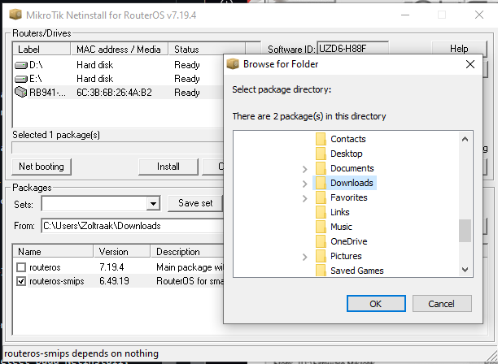

# LAB-13-Netinstall
Kamis 14 Agustus 2025

# Netinstall
  Netinstall adalah tool untuk install dan install ulang perangkat Mikrotik yang menjalankan RouterOS. Gunakan NEtinstall jika menemukan ada yang salah pada perangkat Mikrotik. Tool ini tersedia untuk windows dengan GUI dan Linux dengan CLI.    
    
  **Berikut langkah-langkah Install ulang dengan Netinstall**  
    1. Download Netinstall dengan versi yang stable dari Mikrotik download page.  
    2. Selain netinstall, kita juga perlu RouterOS main package, yang bisa di unduh dari Mikrotik download page.  
    3. Matikan/disable semua network Interface, kecuali satu yang akan digunakan untuk instalasi nantinya.
    4. Setting IP Private di komputer
    5. Ganti IP jadi seperti ini  
        Address : 192.168.88.2  
        Submask : 255.255.255.0  
        Gateway : 192.168.88.1  
        DNS     : 192.168.88.1  
    6. Jika sudah, kembali ke file yang didownload tadi lalu ekstrak.  
    7. Pastikan network interface jalan dan jalankan Netinstall. Jika ada warning pop up, lanjutkan saja dengan klik **run**  
    8. Allow Access untuk Netinstall di Public networks dan konfigurasi Net Booting setting. Isi yang diperlukan, seperti ini.  
    Pertama klik **Net booting** lalu check **Boot Server enabled**, lalu isi Client IP Address yang masih satu segment dengan IP yang di set tadi. Jika sudah klik **OK**.  
      
    
    9. Pastikan device terkoneksi ke komputer dengan kabel ethernet langsung, tanpa ada device lain.  
    10. Sambungkan Kabel UTP dari Komputer ke ether1 pada Mikrotik.  
    11. Sambil menekan tombol resetsambungkan mikrotik dengan power. Tekan dulu tombolnya lalu hubungkan dengan power.  
    12. Jangan lepaskan tombol reset hingga mikrotik terdetect pada Netinstall, sekitar 25.35 detik.  
       
    13. Jika sudah terdeteksi klik Browse dan cari folder tempat download/simpan firmware yang sudah di download sebelumnya.  
    
    14. Checklist checkbox routeros-smips (pilih sesuai firmware yang didownload dan sesuai arch routernya)  
    *Jika ingin konfigurasi lama tidak terhapus, maka check keep old configuration. Dan jika ingin konfigurasi default, check box Aplly default config*  
    15. Klik Install, dan tunggu sampai proses selesai.  
      
    16. Jika sudah selesai, coba remote kembali Mikrotiknya.  
    

# Kesimpulan
Netinstall digunakan untuk menginstall ulang ReouterOS yang memiliki masalah seperti gagal dalam mengupgrade atau menginstall ulang, atau lupa username dan password.  
